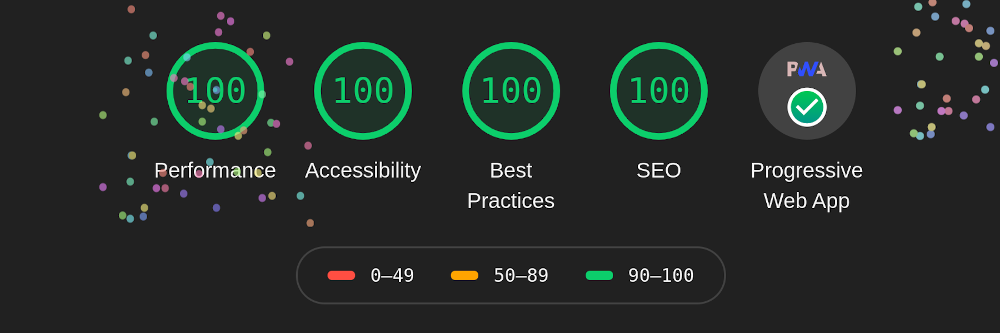

[](https://givemeaverse.com)

[https://givemeaverse.com](https://givemeaverse.com) is a **Progressive Web
Application** written in modern React and TypeScript. It is [performance
optimized](#performance), has [100% test coverage](#100-test-coverage) and
[meets web accessibility guidelines](#accessibility).

It is licensed under the [Mozilla Public License 2.0](LICENSE).

## Technologies

- **Design**:
  - [Figma](https://www.figma.com/) for creating design mockups.
- **Software**:
  - [React.js](https://reactjs.org/)
  - [Create React App](https://create-react-app.dev/)
  - [TypeScript](https://www.typescriptlang.org/)
  - [React Router](https://reacttraining.com/react-router/)
  - [React Helmet](https://github.com/nfl/react-helmet)
  - [query-string](https://www.npmjs.com/package/query-string)
- **CSS**:
  - Written from scratch (ie, no framework).
  - [Sass](https://sass-lang.com/) as a pre-processor.
  - [normalize.css](https://necolas.github.io/normalize.css/) as a reset.
  - [BEM](http://getbem.com/) for naming conventions.
- **Images/SVGs/Fonts**:
  - Logo, favicon and background image created with:
    - [Inkcape](https://inkscape.org/)
    - [svgo](https://github.com/svg/svgo)
    - [Neovim](https://neovim.io/)
  - [Material Design](https://material.io/resources/icons/) for other icons.
  - [FontForge](https://fontforge.org/) for
    [subsetting fonts](src/stylesheets/base/_fonts.scss#L8-L10).
  - [pwa-asset-generator](https://github.com/onderceylan/pwa-asset-generator)
    for generating Apple PWA splash images.
- **Testing and debugging**:
  - [Firefox DevTools](https://developer.mozilla.org/en-US/docs/Tools)
  - [RemoteDebug iOS WebKit Adaptor](https://github.com/RemoteDebug/remotedebug-ios-webkit-adapter)
    for iOS Safari debugging.
  - [Windows 10 Virtual Machine](https://developer.microsoft.com/en-us/microsoft-edge/tools/vms/)
    for Microsoft Edge and
    [Microsoft Narrator](https://en.wikipedia.org/wiki/Microsoft_Narrator)
    (screen reader) testing.

## Accessibility

- **Keyboard navigation** (ie, `<Tab>`, `<Enter>`, `<Esc>`) works predictably.
- **Screen readers** work predictably and don't get confused by menus or
  popups.
- WCAG 2.0 (Web Content Accessibility Guidelines) Level AAA requires a minimum
  **contrast ratio** of 7:1. Every verse has a contrast ratio of [at least
  12:1](src/stylesheets/abstracts/_variables.scss) with any of the backgrounds.

## Third-party bugs found during development

Found and reported two bugs:

- WebKit: [Using vmax for select \<option\> font-size adds a noticeable delay to all
  future interactive events](https://bugs.webkit.org/show_bug.cgi?id=210714)
- WebKit: [iOS PWAs using Service Workers freeze after being
  backgrounded](https://bugs.webkit.org/show_bug.cgi?id=211018)
- Google Chrome: [Chrome on Wayland reports itself as having no pointer and no
  hover](https://bugs.chromium.org/p/chromium/issues/detail?id=1072212)

## Performance



- 100% in Google Chrome **Lighthouse** audit.
- Served via an optimized **Nginx**, HTTP/2, [TLS best
  practices](https://wiki.mozilla.org/Security/Server_Side_TLS),
  and static compression.
- Handwritten CSS is **5.6k** gzipped.

## 100% test coverage

```
-------------------------|----------|----------|----------|----------|-------------------|
File                     |  % Stmts | % Branch |  % Funcs |  % Lines | Uncovered Line #s |
-------------------------|----------|----------|----------|----------|-------------------|
All files                |      100 |      100 |      100 |      100 |                   |
 src                     |      100 |      100 |      100 |      100 |                   |
  App.tsx                |      100 |      100 |      100 |      100 |                   |
 src/components          |      100 |      100 |      100 |      100 |                   |
  About.tsx              |      100 |      100 |      100 |      100 |                   |
  Contact.tsx            |      100 |      100 |      100 |      100 |                   |
  Home.tsx               |      100 |      100 |      100 |      100 |                   |
  PageNotFound.tsx       |      100 |      100 |      100 |      100 |                   |
  RandomVerse.tsx        |      100 |      100 |      100 |      100 |                   |
 src/components/common   |      100 |      100 |      100 |      100 |                   |
  Button.tsx             |      100 |      100 |      100 |      100 |                   |
  Header.tsx             |      100 |      100 |      100 |      100 |                   |
  Logo.tsx               |      100 |      100 |      100 |      100 |                   |
 src/components/verse    |      100 |      100 |      100 |      100 |                   |
  VerseCard.tsx          |      100 |      100 |      100 |      100 |                   |
  VerseControlPanel.tsx  |      100 |      100 |      100 |      100 |                   |
  VerseFooter.tsx        |      100 |      100 |      100 |      100 |                   |
  VerseInfo.tsx          |      100 |      100 |      100 |      100 |                   |
  VerseMain.tsx          |      100 |      100 |      100 |      100 |                   |
  VerseSettings.tsx      |      100 |      100 |      100 |      100 |                   |
  VerseSlideshow.tsx     |      100 |      100 |      100 |      100 |                   |
  index.tsx              |      100 |      100 |      100 |      100 |                   |
 src/constants           |      100 |      100 |      100 |      100 |                   |
  index.ts               |      100 |      100 |      100 |      100 |                   |
 src/contexts            |      100 |      100 |      100 |      100 |                   |
  CardColorContext.tsx   |      100 |      100 |      100 |      100 |                   |
  SlideshowContext.tsx   |      100 |      100 |      100 |      100 |                   |
  ThemeContext.tsx       |      100 |      100 |      100 |      100 |                   |
  TranslationContext.tsx |      100 |      100 |      100 |      100 |                   |
  VerseFontContext.tsx   |      100 |      100 |      100 |      100 |                   |
 src/utils               |      100 |      100 |      100 |      100 |                   |
  index.ts               |      100 |      100 |      100 |      100 |                   |
-------------------------|----------|----------|----------|----------|-------------------|
Test Suites: 13 passed, 13 total
Tests:       86 passed, 86 total
Snapshots:   7 passed, 7 total
Time:        4.554s
Ran all test suites.
Done in 5.43s.
```
